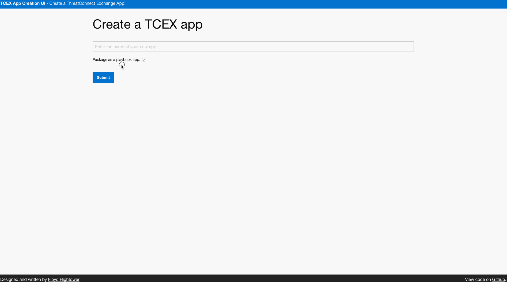

# TCEX App Creation UI

Create a TCEX app: [http://tcex.hightower.space](http://tcex.hightower.space)

## Development Quick Start

Clone the app and run the application at [http://127.0.0.1:5000/](http://127.0.0.1:5000/):

    make run

## Prerequisites

This is a [Flask](http://flask.pocoo.org) app designed to run using python3. It can also be uploaded to Heroku easily.
